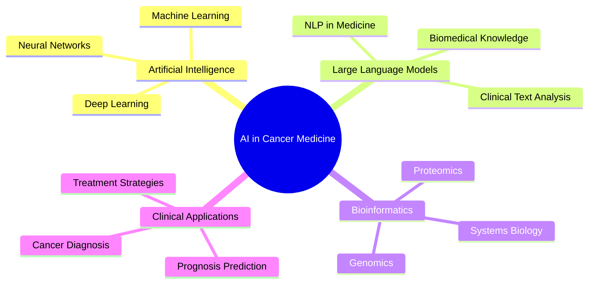

# Hi there! 👋 I'm Justin Seby

<div align="center">
  
[](https://git.io/typing-svg)

</div>

<div align="center">
  
</div>

---

## 🚀 About Me

I'm a **PhD student** at the **Karolinska Institute**, one of the world's leading medical universities, specializing in **AI applications in cancer medicine**. Currently working under the supervision of Prof. Janne Lehtiö at the Lehtiö Lab in the Department of Oncology-Pathology.


### 🎓 **Academic Journey**
- 🔬 **PhD Student** - Karolinska Institute, Sweden
- 🎯 **Master's in Computer Science & Engineering (AI)** - University of Oulu, Finland
- 🏆 **University of Oulu Scholarship** recipient for academic excellence
- 💼 **Experience across**: Cybersecurity, Physics, and Cancer Medicine

### 🔬 **Research Focus**
My work bridges computational innovation with clinical application, developing AI methods to tackle complex cancer challenges and uncover new insights into cancer mechanisms and treatment strategies.

---

## 🧬 Research Interests

<div align="center">



</div>

<div align="center">

| 🤖 **AI & ML** | 🧬 **Bioinformatics** | 🏥 **Healthcare** |
|:---:|:---:|:---:|
| Large Language Models | Computational Biology | Cancer Research |
| Machine Learning | Genomics & Proteomics | Clinical Applications |
| Deep Learning | Systems Biology | Precision Medicine |

</div>

---

## 🛠️ Tech Stack & Tools

<div align="center">

### Programming Languages


### AI/ML Frameworks


### Bioinformatics Tools


</div>

---

## 📊 GitHub Stats

<div align="center">
  


</div>

<div align="center">
  
[](https://git.io/streak-stats)

</div>

---

## 🏆 Achievements & Recognition

<div align="center">

```
🎓 University of Oulu Scholarship Recipient
🔬 PhD Researcher at World-Renowned Karolinska Institute
🤖 AI Expert in Healthcare Applications
🧬 Published Researcher in Cancer Medicine
💡 Innovation in Bioinformatics
```

</div>

---

## 🌟 Featured Projects

<div align="center">

[](https://github.com/YourGitHubUsername/cancer-ai-analysis)
[](https://github.com/YourGitHubUsername/bioinformatics-pipeline)

</div>

---

## 🤝 Let's Connect!

<div align="center">

[](mailto:justin.seby@ki.se)
[](https://linkedin.com/in/justin-seby)
[](https://researchgate.net/profile/Justin-Seby)
[](https://orcid.org/your-orcid-id)

</div>

---

<div align="center">

### 💡 "Bridging AI Innovation with Cancer Medicine"


*If you're interested in AI-driven cancer research or potential collaborations, I'm always open to meaningful discussions!*

---


</div>

---

<div align="center">
  
</div>
